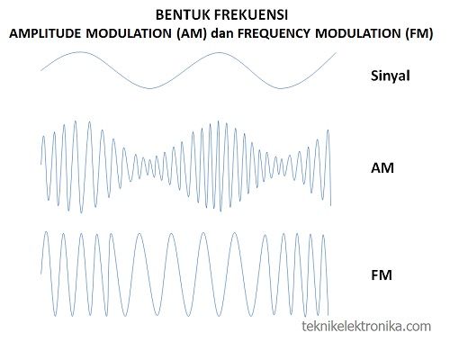
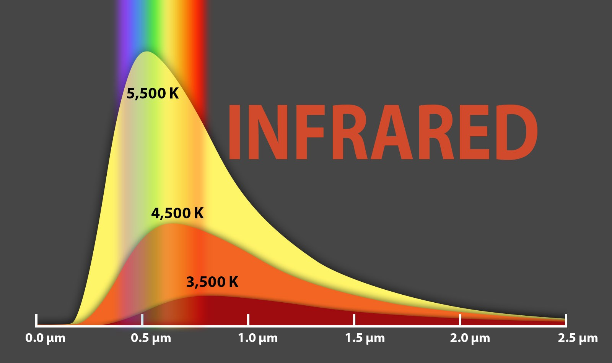

# MEMAHAMI SINYAL RF (RADIO FREKUENSI)
Sinyal RF merupakan gelombang elektromagnetik yang digunakan oleh sistem komunikasi untuk mengirim informasi melalui udara dari satu titik ke titik lain. Sinyal RF telah digunakan selama beberapa tahun. Sinyal tersebut memberikan cara untuk mengirimkan musik pada radio FM dan video pada televisi. Pada kenyataannya, sinyal RF juga merupakan sarana umum untuk mengirim data melalui jaringan wireless.

## Sinyal RF:
Sinyal RF merambat di antara antena pemancar pengirim dan penerima. sinyal yang dipasok pada antena memiliki amplitudo, frekuensi, dan interval. Sifat-sifat tersebut berubah-ubah setiap saat untuk merepresentasikan informasi.
Amplitudo mengindikasikan kekuatan sinyal. Ukuran untuk amplitudo biasanya berupa energi yang dianalogikan dengan jumlah usaha yang digunakan seseorang pada waktu mengendarai sepeda untuk mencapai jarak tertentu. Energi, dalam konteks sinyal elektromagnetik, menggambarkan jumlah energi yang diperlukan untuk mendorong sinyal pada jarak tertentu. Saat energi meningkat, jaraknya pun juga bertambah.

Saat sinyal radio merambat melalui udara, sinyal tersebut kehilangan amplitudo. Jika jarak antara pengirim dan penerima bertambah, amplitudo sinyal menurun secara eksponensial. Pada lingkungan yang terbuka, di mana tidak ada rintangan, sinyal RF mengalamai apa yang disebut para engineer sebagai free-space loss yang merupakan bentuk dari pelemahan. Kondisi tersebut menyebabkan sinyal yang telah dimodulasi melemah secara eksponensial saat sinyal merambat semakin jauh dari antena. Oleh karena itu, sinyal harus memiliki cukup energi untuk mencapai jarak di mana tingkat sinyal bisa diterima sesuai yang dibutuhkan receiver. Kemampuan receiver dalam menerima sinyal tergantung pada kehadiran sinyal-sinyal RF lain yang berada di dekatnya. Frekuensi menyatakan beberapa kali sinyal berulang setiap detiknya. Satuan frekuensi adalah Hertz (Hz) yang merupakan jumlah siklus yang muncul setiap detik. Sebagai contoh, LAN nirkabel 802.11 beroperasi pada frekuensi 2,4 GHz yang berarti mencakup 2.400.000.000 siklus per detik. Interval berkaitan dengan seberapa jauh suatu sinyal tetap konstan pada titik acuan.

# PENGERTIAN GLOMBANG RADIO FM & AM
## Sinyal FM
Sinyal FM merupakan suatu bentuk modulasi dimana frekuensi sinyal pembawa divariasikan secara proposional berdasarkan amplitudo sinyal informasi. Amplitudo sinyal pembawa tetap konstan. Contoh dari FM adalah frekuensi radio yang sekarang lebih sering digunakan radio pada umumnya.
Rentang frekuensi FM adalah 88 MHz – 108 MHz sehingga dikategorikan sebagai Very High Fequency (VHF). Sedangkan panjang gelombangnya adalah dibawah 1000 KHz sehingga jangkauan sinyalnya tidak jauh. Modulasi frekuensi memiliki bandwidth yang lebih lebar daripada modulasi amplitudo sehingga bisa menghasilkan suara stereo dengan menyatukan beberapa saluran audio pada satu gelombang cerrier. FM lebih tahan terhadap gangguan sehingga dipilih untuk sebagai modulasi standar untuk frekuensi tinggi. Keuntungan FM antara lain potensi gangguan jauh lebih kecil (kualitas lebih baik) dan daya yang dibutuhkan lebih kecil.

## Sinyal AM
Sinyal AM merupakan salah satu bentuk modulasi dimana sinyal informasi digabungkan dengan sinyal pembawa (carrier) berdasarkan perubahan amplitudonya.Bentuk modulasi dimana amplitudo sinyal pembawa di variasikan secara proposional berdasarkan sinyal pemodulasi (sinyal informasi). Frekuensi sinyal pembawa tetap konstan.Besarnya amplitudo sinyal informasi mempengaruhi besarnya amplitudo dari carrier, tanpa mempengaruhi besarnya frekuensi sinyal pembawa. Parameter sinyal yang mengalami perubahan adalah amplitudonya, Amplitudo sinyal pembawa berubah-ubah sesuai dengan perubahan amplitudo sinyal informasi. Rentang frekuensi AM adalah 500 Hz – 1600 KHz dan panjang gelombang atau amplitudo AM adalah 1600 KHz – 30000 KHz. Jika direntangkan dengan satuan meter, jangkauan sinyal AM bisa mencapai puluhan ribu kilometer.
AM adalah metode pertama kali yang digunakan untuk menyiarkan radio komersil. Kelemahan dari sistem AM adalah mudah terganggu oleh gangguan atmosfer dan kualitas suara terbatasi oleh bandwidth yang sempit.Gelombang AM mengalir dekat dengan tanah pada siang hari dan semakin tinggi ke angkasa pada malam hai, yang artinya sulit untuk mendapatkan radius penyiaran selama jam siang. AM juga mudah terhalang oleh bangunan tinggi.

# INFARED (INFRAMERAH)
Infrared ini merupakan sebuah radiasi elektromagnetik yang gelombangnya lebih pendek dari radiasi gelombang yang dikeluarkan radio, tapi juga lebih panjang dari gelombang cahaya yang terlihat.Gelombang inframerah atau cahaya inframerah adalah bagian dari spektrum elektromagnetik. Setiap hari kita sering menjumpai gelombang inframerah, namun tidak bisa melihatnya hanya menggunakan mata telanjang, meskipun bisa mendeteksinya sebagai panas.Untuk mengoperasikan televisi, remote control memanfaatkan gelombang cahaya tepat di luar spektrum cahaya kasat mata, yaitu gelombang cahaya inframerah. Wilayah spektrum ini dibagi menjadi inframerah-dekat, menengah dan jauh. Wilayah spektrum antara 8-15 mikron (μm) disebut inframerah termal oleh para ilmuwan sains planet Bumi, karena panjang gelombang ini sangat ideal untuk mempelajari energi panas yang terpancar dari planet kita.

# BLUETOOTH
Bluetooth adalah suatu peralatan media komunikasi yang dapat digunakan untuk menghubungkan sebuah perangkat komunikasi dengan perangkat komunikasi lainnya, bluetooth umumnya digunakan di handphone, komputer atau pc, tablet, dan lain-lain.Bluetooth beroperasi dalam pita frekuensi 2,4 GHz dengan menggunakan sebuah frequency hopping traceiver yang mampu menyediakan layanan komunikasi data dan suara secara real time antara host-host bluetooth dengan jarak terbatas.

## jenis Bluetooth
#### 1. Bluetooth 1.0 dan 1.0B.
#### 2. Bluetooth 1.1. 
#### 3. Bluetooth 1.2.
#### 4. Bluetooth 2.0 + EDR
#### 5. Bluetooth 2.1 + EDR
#### 6. Bluetooth 3.0 + HS
#### 7. Bluetooth 4.0 + LE
#### 8. Bluetooth 4.1.

# WIFI
Wifi adalah suatu standar dari jaringan tanpa menggunakan kabel atau juga dikenal sebagai Wireless Networking yang berfungsi sebagai penyempurna berbagai komponen di dalam jaringan internet supaya dapat terkoneksikan atau supaya dapat terhubung dengan internet dengan lebih praktis dan mudah.

## jenis Wifi
#### 802.11a 
wifi jenis ini dapat bekerja pada frekuensi 5 GHz.jaringan ini memiliki kecepatan transfer sata sampai 58 Mbps. Kecepatan wifi ini tergolong cepat namun ada satu kekurangan, yakni sinyal yang didapatkan biasanya pendek dan lebih mudah terlambat.
#### 802.11b
802.11b adalah jenis wifi yang berjalan pada sinyal radio yang tidak berarturan. Karena sifatnya yang tidak beraturan, jaringan ini dapat melakuan gangguan pada berbagai macam peralatan seperti oven microwave atau perangkat lainnya di frekuensi yang sama dengan 802.11b, yakni 2,4 GHz.
#### 802.11g
teknologi ini lebih baik dibandingkan tipe 802.11a dan 802.11b. Bisa dibilang, 802.11g adalah teknologi wifi yang menggabungkan keunggulan dari 802.11a dan 802.11b.
#### 802.11n
802.11n adalah standar jaringan yang lebih baik dari 802.11g. Jenis wifi ini merupakan versi perbaikan dari 802.11g dalam hal kecepatan karena mampu memnafaatkan sinyal nirkabel dan antena. Tidak aneh, jika tipe wifi ini memiliki transfer data mencapai 100-200 Mbps.
#### 802.11ac 
802.11ac adalah tipe wifi yang memiliki frekuensi 5 GHz. Hal ini berarti tipe wifi ini memiliki kompabilitas dengan 802.11a yang ada di frekuensi yang sama. Sementara untuk kecepatan datanya, tipe wifi ini bisa mencapai 1,3 Gpbs, berkali lipat lebih cepat dari 802.11n.
#### 802.11ax 
tipe wifi yang jadi penerus dari 802.11ac. Tipe wifi ini masih memakai pita di frekuensi 5 GHz. Hanya saja kecepatan dari wifi ini bisa mencapai 3,5 Gbps, yang jelas lebih cepat dari 802.11ac.
#### 802.11ad
802.11ad adalah tipe jaringan yang bakal jadi cikal bakal akses internet super cepat melalui wireless atau tanpa kabel. Hal ini karena 802.11ad  bekerja di spektrum gelombang milimeter 60 GHz, yang memiliki karakteristik berbeda dengan pita 2,4 GHz dan 5 GHz, tempat jaringan wifi beroperasi.
Karena itu, 802.11ad bisa jadi bukan masuk kategori wifi karena sering disebut sebagai next wifi, dengan nama WiGig. Dengan jaringan ini, transfer data bisa sangat cepat yakni 7 Gbit /detik. Meskipun belum ada ponsel yang mendukung jaringan 802.11ad, sudah ada router dari TP-Link yang mendukung jaringan ini.
Selain ketujuh jaringan wifi tersebut, ada juga tipe wifi lain seperti 802.11ai, 802.11aj, 802.11ah, dan lainnya. Namun, umumnya HP zaman sekarang mendukung jaringan dari  802.11a, 802.11b, 802.11g, 802.11n, dan 802.11ac. Beberapa ponsel kelas atas malah kini sudah mendukung jaringan 802.11ax.

# ENCODING
Tujuan Encoding adalah mengubah data yang dapat digunakan oleh berbagai macam sistim secara tepat dan aman. Seperti mengirimkan data yang berbentuk biner lewat email (seperti attachment), menyimpan data biner ke dalam database atau menampilkan karakter-karakter special pada halaman web atau media lainnya. Biasanya data itu diterjemahkan kedalam karakter sesuai dengan tipe yang digunakan.
